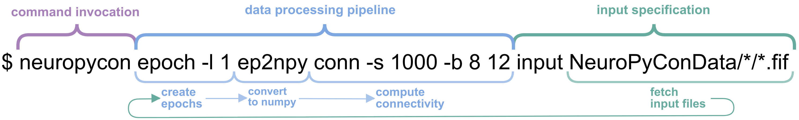

:orphan:

.. _neuropycon_cli:

Command Line interface (CLI)
****************************

CLI provides a command line interface to :ref:`ephypype` and is designed
to make the best use of UNIX shell capabilities and nipype framework
for parallel processing of MEEG datasets.

In brief, it utilizes pattern matching capabilities of UNIX shell
to select files we want to process from nested folders structure of a dataset
and then creates on the go a processing **pipeline** combining
computational **nodes** defined in :ref:`ephypype` package.

In practice it looks like this:

Example above shows how connectivity metrics can be computed on a group of files.
This command grabs all the :code:`.fif` files in the two-level nested folder structure,
creates one-second epochs from them, converts epochs to numpy arrays format,
performs connectvity metrics calculation on the converted data and saves the results.

.. For more examples please consult :ref:`examples`

.. Quickstart
.. ----------
.. First follow the installation instructions in `README <https://github.com/neuropycon/neuropycon_cli>`__

.. toctree::
   :maxdepth: 3
   :caption: Documentation Contents:

   tutorial
   commands

.. Submodules
.. ----------

.. neuropycon\_cli\.neuropycon module
.. ----------------------------------

.. .. automodule:: neuropycon_cli.neuropycon
..     :members:
..     :undoc-members:
..     :show-inheritance:

.. Module contents
.. ---------------

.. automodule:: ephypype.commands
    :members:
    :undoc-members:
    :show-inheritance:

.. Indices and tables
.. ==================

.. * :ref:`genindex`
.. * :ref:`modindex`
.. * :ref:`search`
