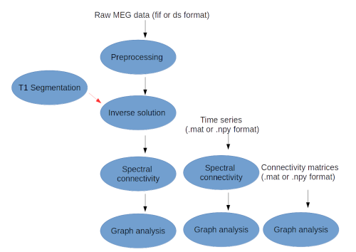

.. _neuropycon:

Neuropycon
**********

Neuropycon is an open-source multi-modal brain data analysis kit which provides **Python-based
pipelines** for advanced multi-thread processing of fMRI, MEG and EEG data, with a focus on connectivity
and graph analyses. Neuropycon is based on `Nipype <http://nipype.readthedocs.io/en/latest/#>`_,
a tool developed in fMRI field, which facilitates data analyses by wrapping many commonly-used neuro-imaging software into a common
python framework.

Neuropycon project includes two different packages:

* :ref:`ephypype` based on |MNE python| includes pipelines for electrophysiology analysis
* |graphpype| based on |radatools| includes pipelines for graph theoretical analysis of neuroimaging data

.. |MNE python| raw:: html

   <a href="http://martinos.org/mne/stable/index.html" target="_blank">MNE python</a>

.. |radatools| raw:: html

   <a href="http://deim.urv.cat/~sergio.gomez/radatools.php" target="_blank">radatools</a>

.. |graphpype| raw:: html

   <a href="https://github.com/neuropycon/graphpype" target="_blank">graphpype</a>

Neuropycon provides a very common and fast framework to develop workflows for advanced analyses, in particular
defines a set of different **pipelines** that can be used stand-alone or as **lego** of a bigger workflow:
the input of a pipeline will be the output of another pipeline.

For each possible workflow the **input data** can be specified in three different ways:

* raw MEG data in **.fif** and **.ds** format
* time series of connectivity matrices in **.mat** (Matlab) or **.npy** (Numpy) format
* connectivity matrices in **.mat** (Matlab) or **.npy** (Numpy) format

.. _lego:

   Main inputs and subsequent pipeline steps

Each pipeline based on nipype engine is defined by **nodes** connected together,
where each node maybe wrapping of existing software (as MNE-python modules or radatools functions)
as well as providing easy ways to implement function defined by the user.

.. _ephypype:

ephypype
********

The ephypype package includes pipelines for electrophysiology analysis.
It's based mainly on MNE-Python package, as well as more standard python libraries such as Numpy and Scipy.
Current implementations allow for

* MEG/EEG data import
* MEG/EEG data pre-processing and cleaning by an automatic removal of eyes and heart related artifacts
* sensor or source-level connectivity analyses

The ephypype package provides the following **pipelines**:

* the :ref:`preprocessing pipeline <preproc_meeg>` runs the ICA algorithm for an automatic removal of eyes and heart related artefacts
* the :ref:`power pipeline <power>` computes the power spectral density (PSD) on sensor space
* the :ref:`source_reconstruction` computes the inverse solution starting from raw/epoched data
* the :ref:`spectral_connectivity <spectral_connectivity>` perform connectivity analysis in sensor or source space

.. comment:
    Pipelines
    =========
    
    .. toctree::
       :maxdepth: 3
    
       preproc_meeg
       power
       source_reconstruction
       spectral_connectivity

Installation
============

.. toctree::
   :maxdepth: 1

   includeme
