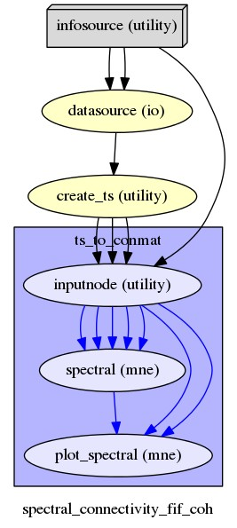

.. _spectral_connectivity:

Connectivity pipeline
=====================

The connectivity pipeline is so far based on the spectral connectivity computation of |MNE python|.
In the **frequency-domain**, all MNE-Python measures (e.g. Coherence, Imaginary Coherence, Phase Locking Value, 
Phase-Lag Index), and some derived measurements are currently available.
In the **time-domain**, coupling such as correlation of envelope, or phase-amplitude coupling (using |Brainpipe|) are also available. 

.. |MNE python| raw:: html

   <a href="http://martinos.org/mne/stable/auto_examples/index.html#connectivity-analysis-examples" target="_blank">MNE python</a>
   
.. |plot_connectivity_circle| raw:: html

   <a href="http://martinos.org/mne/dev/generated/mne.viz.plot_connectivity_circle.html#mne.viz.plot_connectivity_circle" target="_blank">plot_connectivity_circle</a>

.. |Brainpipe| raw:: html

   <a href="https://github.com/EtienneCmb/brainpipe" target="_blank">Brainpipe</a>

The input data should be 

* the output of :ref:`preproc_meeg` or :ref:`source_reconstruction` (time series in **.npy** format) or
* a time series matrix in sensor or source space (**.mat** format)

.. comment: an epoched or raw data (**.fif** format)

The outputs is the **spectral connectivty matrix in .npy format** stored in the workflow directory
and can be used as input of the |create_pipeline_conmat_to_graph_density| performing graph analysis
on the computed connectivity matrix.

.. |create_pipeline_conmat_to_graph_density| raw:: html

   <a href="http://davidmeunier79.github.io/graphpype/conmat_to_graph.html#create-pipeline-conmat-to-graph-density" target="_blank">create_pipeline_conmat_to_graph_density</a>

The connectivity pipeline is implemented by the function :py:func:`create_pipeline_time_series_to_spectral_connectivity <ephypype.pipelines.ts_to_conmat.create_pipeline_time_series_to_spectral_connectivity>`
and its Nodes :py:class:`spectral <ephypype.interfaces.mne.spectral.SpectralConn>` and
:py:class:`plot_spectral <ephypype.interfaces.mne.spectral.PlotSpectralConn>`
wraps the MNE Python functions  |spectral_connectivity| and |plot_connectivity_circle| to visualize the connectivity matrix as a circular graph.

.. |spectral_connectivity| raw:: html

   <a href="http://martinos.org/mne/stable/generated/mne.connectivity.spectral_connectivity.html?highlight=spectral_connectivity#mne.connectivity.spectral_connectivity" target="_blank">spectral_connectivity</a>

   

   
.. note:: A list of the different connectivity measures implemented by MNE can be found in the description of |here|.

.. |here| raw:: html

   <a href="http://martinos.org/mne/stable/generated/mne.connectivity.spectral_connectivity.html?highlight=spectral_connectivity#mne.connectivity.spectral_connectivity" target="_blank">spectral_connectivity function</a>

.. seealso:: See :ref:`sphx_glr_auto_examples_plot_connectivity.py` to get an example on how to write a connectivity and graph analysis workflow.
